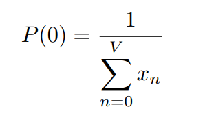

# Kaufman - Roberts Formula
Kaufman-Roberts is a multi-dimensional Erlang method that you use when multiple services share a common resource pool.

The Kaufman-Roberts functions compute the blocking probability when the total capacity of a link is composed of a
different number of traffic flows or channels, and each flow or channel is smaller than the maximum capacity of the link.

##### Source:
* [IBM Documentation](https://www.ibm.com/docs/en/tnpm/1.4.4?topic=functions-kaufman-roberts-based)

## Used formulas

** Formula used for P(n) and x(n)**

        <kbd>

                </kbd>

**Formula used for P(0)**

        <kbd>

                </kbd>

**Formula used for b(i)**

        <kbd>

                </kbd>

##### Source:
*[PUT Poznań](https://ekursy.put.poznan.pl/)
